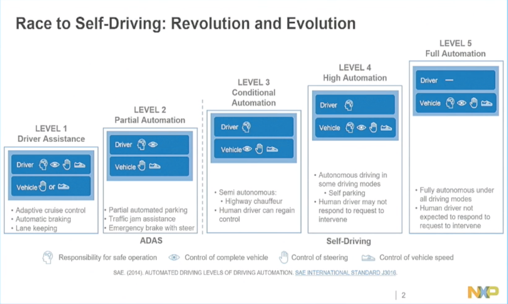
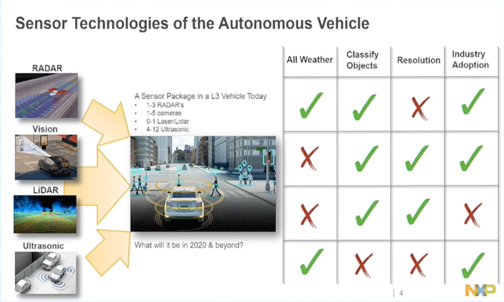

# Notes on autonomous driving

## FAQ
### Q: Will multiple lidars interfere?
tl;dr: Yes but very unlikely and easy to filter out.
> A1: From direct industry information. Yes, there is multi path errors, but they're so random (and limited) that they typically get filtered out. [reddit](https://www.reddit.com/r/robotics/comments/7gyswt/will_selfdriving_vehicle_lidar_interfere_with/) 

> A2: It took me a bit to understand that the laser spot that a lidar projects is tiny and moving really fast so the chances of your laser spot hitting another lidar's laser spot are tiny even with multiple lidar's nearby. This is in contrast to an ultrasound sensor for example, which generates a wide sound wave that any other sensor nearby will detect.

> A3: Laser range finding is done by firing a laser pulse, at a slight angle, and watching where the dot shows up linearly, and the timing at which it shows up, and possibly even the size of the dot.

> This allows you to use trigonometry to determine the distance to the point you aimed at. The lidar does this, but hundreds of time a second while spinning around in a circle changing its targeting angle constantly.

> At any given moment, Each lidar is only ever looking for a reflection from the spot it fired itself at, and is blind to everywhere else in it's range. So, it's unlikely that even with hundreds of lidars in a traffic jam that you'd have more than a few in range of each other, and even less likely that they'd be measuring the same ~1mm diameter spot. and even if they did interfere on a point, it'd likely be tossed out by a filtering algorithm, or even pulse modulation that allows the lidar to identify which pulses are it's own.

> So yes, it's a problem, but it's largely a solved one. Source: I did research previously on how to build a rangefinder from scratch.

### Q: Will multiple radars interfere?
tl;dr: Yes it is worse than lidar interference, and needs to be addressed.
> A1: Google and Raytheon has a [paper](http://sci-hub.tw/10.1109/SAHCN.2016.7733011) ([slides](https://slideplayer.com/slide/10904536/)) to talk about this. Uncoordinated assignment results in radar blindness when as few as 4 cars are within the transmission range.

> A2: Definitely there would be interference between the radar frequencies when most of the vehicles equipped with radar are close by. There are researchers happening around the world to tackle this problem termed as ‘interference mitigation'. Also there are papers published describing various methods to solve the interference problem. (from [Quora](https://www.quora.com/If-self-driving-cars-continue-to-use-radar-for-rangefinding-wont-they-have-problems-when-there-are-hundreds-of-them-on-the-same-stretch-of-road-all-using-the-same-frequencies))

> A3: the better solution is probably to use Spread spectrum - Wikipedia technology. This is how modern military radars work. It has huge advantages in that it produces no signal collisions, almost no interference with other users of the spectrum (including other cars), very secure and effectively impossible to spoof, and is very difficult to block. (from [Quora](https://www.quora.com/If-self-driving-cars-continue-to-use-radar-for-rangefinding-wont-they-have-problems-when-there-are-hundreds-of-them-on-the-same-stretch-of-road-all-using-the-same-frequencies))

## Lidar/Radar resources
- Different methods to measure distance with light ([youtube](https://www.youtube.com/watch?v=ddxguAzzzJE))
-  A critical component of most self-driving cars
is a set of long-range (150m-250m) radar sensors that, along
with LIDAR and/or cameras, map the environment including
cars, obstacles, and pedestrians [5]. Automotive long-range
radars commonly in use today are based on Frequency Modulated Continuous Wave (FMCW) [2], [16], and operate in the
76-77 GHz band [3] with a total bandwidth of 1 GHz. (from [radarMAC paper](http://sci-hub.tw/10.1109/SAHCN.2016.7733011))
- Radars are moving from 24 GHz to 77 GHz in automotive radars. The range resolution of a 77GHz system can be 4cm versus 75cm for 24GHz radar, allowing better detection of multiple objects that are close together. (...) as sensors move from 24GHz to 77GHz, velocity measurements can improve by 3x. (...) the total area needed for a 77GHz antenna is one-ninth the size of a similar 24GHz antenna.(from [Texas Instruments](https://e2e.ti.com/blogs_/b/behind_the_wheel/archive/2017/10/25/why-are-automotive-radar-systems-moving-from-24ghz-to-77ghz))
	- Historically short-range radars (SRR) used 24 GHz, and long range radars (LRR) are using 77 GHz.
- Excellent video from NXP on the [The latest developments in radar technology for automotive](https://youtu.be/MiVCee1UfJs?t=262).
- Nice way to visualize L1-L5 from NXP. ADAS for L1-L2, and autonomous driving for L3-L5.

- Comparison of different sensors. OEM and tier-1 are asking for more resolution from radars for L3, L4 autonomous driving.

- [Automotive supply chain explained](https://medium.com/self-driving-cars/the-automotive-supply-chain-explained-d4e74250106f). Manufactures are OEMs. Direct part suppliers are tier-1.
- MIMO has virtual channels. 3Tx/4Rx goes to 12Tx/16Rx.

## Radar providers
- [SmartMicro](https://youtu.be/MiVCee1UfJs?t=262): German company with footprint in China. 